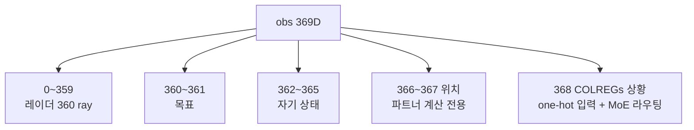
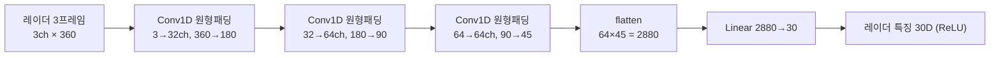
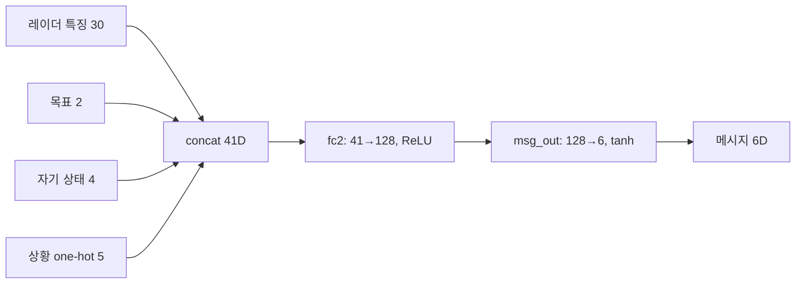
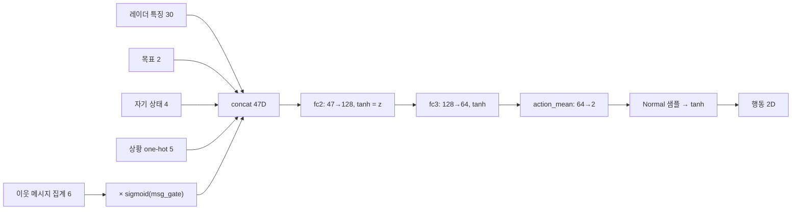
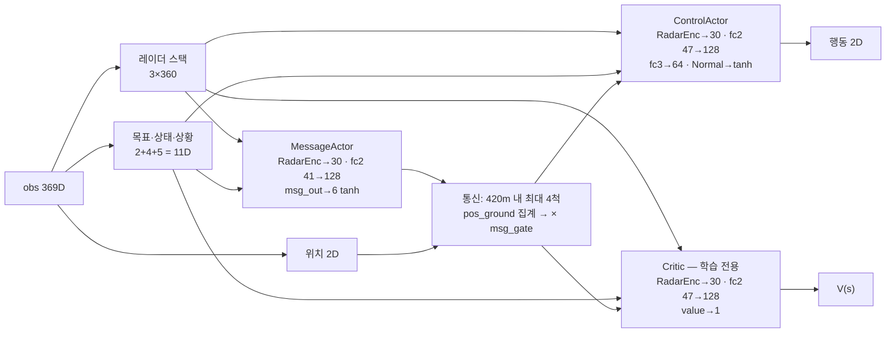
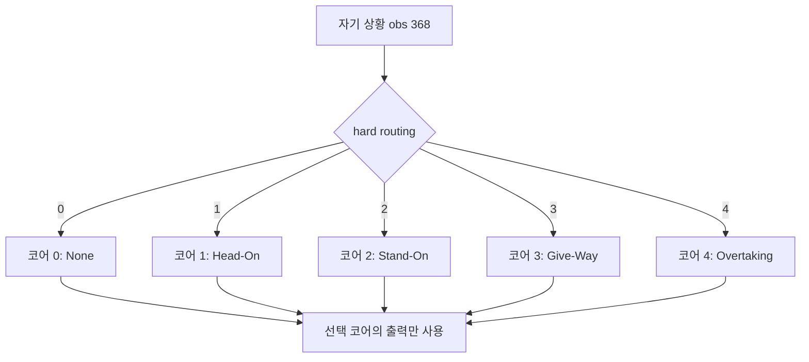
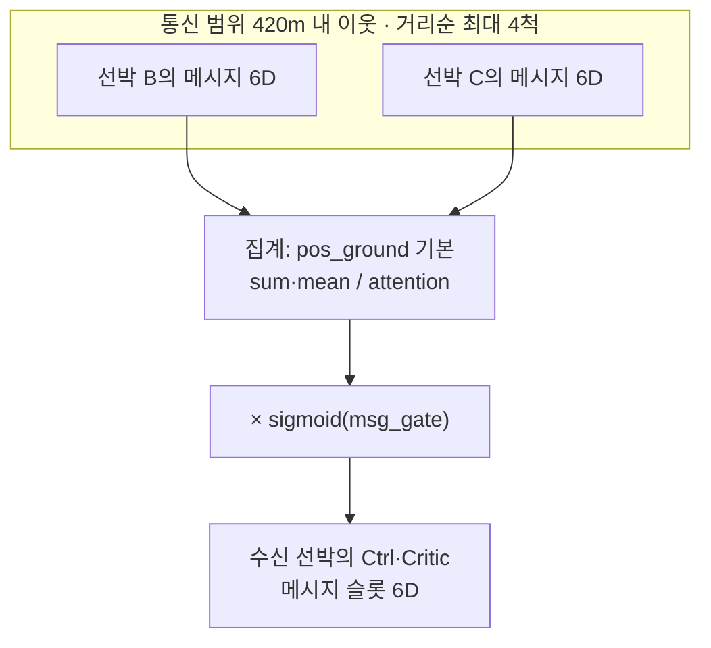
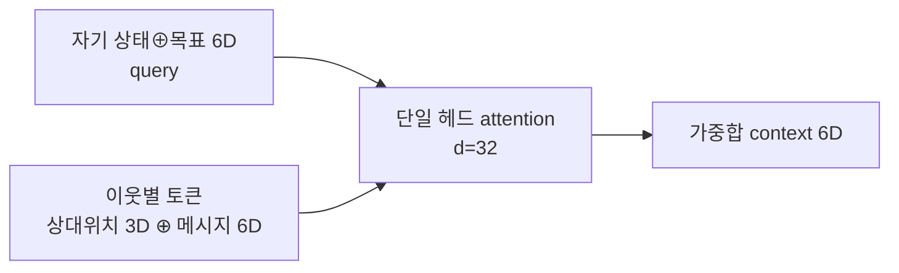
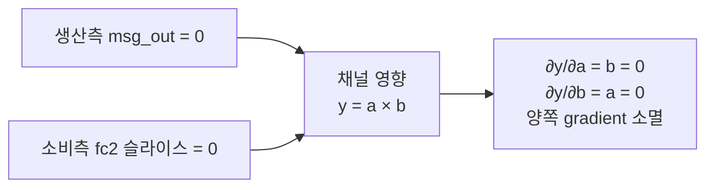

# Vessel 신경망 구조 정리

> `networks.py`, `config.py`, `VesselAgent.cs`에서 직접 확인한 내용만 기록한다.
> 저장소 CLAUDE.md의 obs 59D / ARPA 서술은 구버전이며, 현재 코드와 일치하는 문서는 이쪽이다.

---

## 1. 개요

모든 선박이 하나의 정책을 공유한다(shared policy). 선박 한 척의 정책은 세 개의 네트워크로 구성된다.

- MessageActor — 자기 관측을 6차원 latent 메시지로 인코딩해 통신 범위 내 이웃에게 전송
- ControlActor — 자기 관측과 이웃 메시지 집계를 입력으로 행동(타각·추력)을 출력
- Critic — 상태가치 추정. 학습 시에만 사용하며 실행 시에는 관여하지 않음

---

## 2. 입력 — 관측 벡터 369D

Unity가 결정 스텝마다 369개 float을 전송한다.

| 구간 | 차원 | 내용 | 신경망 입력 여부 |
|---|---|---|---|
| `[0:360]` | 360 | 레이더 360 ray(1° 간격) 거리. 값 = 거리/56m − 0.5, 미감지 시 +0.5 | 포함 (3프레임 스택) |
| `[360:362]` | 2 | 목표 — 거리 d/(d+150), 각도/180 | 포함 |
| `[362:366]` | 4 | 자기 상태 — 속도, 회전율, 헤딩, 현재 타각 (정규화) | 포함 |
| `[366:368]` | 2 | 절대위치 x, z — 통신 파트너 계산 전용 | 제외 |
| `[368]` | 1 | COLREGs 상황 0~4 (None/HeadOn/CrossingStandOn/CrossingGiveWay/Overtaking) | 포함 — one-hot 5D. `VESSEL_SITUATION_INPUT=0`이면 제외(ablation). MoE 라우팅 겸용 |

프레임 스택은 레이더 구간에만 적용한다(3프레임, 3×360=1080). 단일 프레임으로는 접촉물의 접근/이탈을 구분할 수 없고, 프레임 간 차이에서 방위 변화율(bearing-rate)을 인코더가 직접 추출하게 하려는 것이다. 목표·자기 상태는 스택하지 않는다.

COLREGs 상황은 Unity가 자기 센서 반경(56m = 레이더 범위) 내 기하로 판정한 값이다. 실제 선박의 ARPA/AIS가 제공하는 것과 동등한 정보라 현실적 관측으로 간주하며, 통신 ON/OFF 양쪽에 동일하게 입력되므로 비교 공정성을 해치지 않는다. 값은 1스텝 지연되어 도착한다(의도된 설계).

---

## 3. RadarEncoder —> 360 ray를 30차원 압축

세 네트워크가 각각 독립된 RadarEncoder 인스턴스를 보유

설계 :
- 원형 패딩 — 각도는 순환하므로 ray 359°와 0°는 인접 데이터다. 일반 패딩이면 정면을 가로지르는 접촉물이 배열 경계에서 분리되어 하나의 물체로 인식되지 않는다.
- 프레임을 입력 채널로 — 같은 각도 bin의 프레임 간 차이가 곧 그 방향 접촉물의 접근 속도와 방위 변화율이다. 충돌 판단의 핵심량(방위 불변 + 거리 감소 = 충돌 코스)을 conv 첫 층에서 바로 계산할 수 있다.
- stride-2 conv 3회 — 고정 min-pool 대신 학습형 다운샘플. 같은 30차원으로 압축하되 무엇을 남길지를 데이터에서 학습한다.
- flatten 크기는 더미 forward로 산출 — ray 수나 stride를 바꿔도 차원이 자동으로 맞도록 하드코딩을 피했다.

---

## 4. Network.py

공통 입력: `레이더 특징 30 + 목표 2 + 자기 상태 4 + COLREGs 상황 one-hot 5 = 41D`
(`VESSEL_SITUATION_INPUT=0`이면 상황 제외 36D)

### 4.1 MessageActor

- 메시지의 의미는 사전에 정의하지 않는다. 무엇을 인코딩할지는 학습이 결정한다(latent 통신).
- `msg_out`은 표준 초기화의 ×0.1로 시작한다(부록 A.2).

### 4.2 ControlActor

- `msg_gate`: 이웃 메시지에 `sigmoid(g)`를 곱하는 학습형 스칼라. 초기 g=0(계수 0.5). 메시지가 유익하면 열고 해로우면 닫는 것을 학습이 결정한다. 통신 OFF에서는 메시지가 0이므로 게이트는 결과에 영향이 없다(비교 공정성 유지). 상세는 부록 A.3.
- 행동은 확률적이다. 평균에 가우시안 노이즈를 더해 샘플한 뒤 tanh로 [−1,1]에 사상한다(squashed Gaussian). 탐색 노이즈 σ는 per-dim 학습 파라미터(rudder ≈0.37, thrust ≈0.61 시작)로 fc 경로와 별도로 존재한다.

### 4.3 Critic

구조는 ControlActor의 backbone과 동일하되(47→128, 활성함수는 ReLU) 출력이 상태가치 1차원(128→1)이다. advantage 계산의 기준선을 제공하며, 별도의 msg_gate를 보유한다(부록 A.4).

### 4.4 전체 구조도 — 기본 구성 (단일망, USE_MOE=0)

obs 파싱부터 행동·가치 출력까지의 전체 순전파. 세 네트워크는 RadarEncoder를 공유하지 않고 각자 보유한다.

- C5c coupling(`VESSEL_COMM_CONSUMER_COUPLING=1`) 사용 시 z에서 consumer_decoder(128→64→K×2)가 분기하고 그 출력이 fc3 입력에 concat된다(기본 OFF).
- msg_gate는 ControlActor와 Critic이 각각 별도로 보유한다.
- concat 순서는 [radar, goal, self, situation, msg]로 메시지가 항상 마지막이다 — fc2 메시지 슬라이스 인덱싱(`[:, -msg_dim:]`, 소진폭 초기화·grad 텔레메트리)이 이 순서에 의존한다.

### 4.5 전체 구조도 — MoE 구성 (USE_MOE=1)

4.4의 코어(RadarEncoder 포함 전체)가 네트워크마다 5벌로 복제되고, obs[368]의 상황 인덱스가 샘플별로 코어 하나를 선택한다. MessageActor·ControlActor·Critic 각각 5벌 = 총 15코어.

MoE 동작의 요점:

- 라우팅은 hard 방식이다. 샘플마다 해당 상황의 코어만 forward하고, gradient도 그 코어에만 흐른다(코어 간 가중치 공유 없음).
- 파트너 메시지를 재생성할 때는 파트너 자신의 상황(rollout 시 저장된 값)으로 MessageActor 코어를 라우팅한다.
- 업데이트는 rollout에 저장된 상황값으로 동일하게 재라우팅한다 — rollout과 업데이트의 코어 선택이 일치해야 PPO ratio가 유효하다.
- 상황 one-hot 입력은 MoE에서도 각 코어에 들어간다. 코어 내부에서는 상수이므로 중복이지만 동작에는 무해하다.
- GroundedAttention, 보조 디코더 4종, oracle 경로는 MoE 대상이 아니며 단일 인스턴스로 유지된다.

---

## 5. 통신 경로

집계 방식 (우선순위: attention > pos_ground > sum/mean):

- `pos_ground` (기본) — 각 이웃의 메시지 6D에 그 이웃의 상대위치 [방위 sin·cos, 거리/420] 3D를 붙여 msg_encoder(9→32→6 MLP)로 인코딩한 뒤 유효 이웃 수로 평균. 상대위치는 수신자가 국소적으로 계산하므로 채널 대역폭을 쓰지 않으며(실제 AIS가 위치를 메시지에 동봉하는 것과 같은 구조), "어느 방위에서 온 정보인지"가 보존되어 방향성 회피가 학습 가능하다. rollout 경로는 배치 벡터화되어 있으며(per-agent 루프의 커널 런치 병목 회피), update의 masked-mean과 동일 함수형이라 PPO ratio가 유효하다.
- `sum` / `mean` (`VESSEL_POS_GROUND=0` + `VESSEL_AGG_MODE`) — 단순 합산/평균. 강도형 정보(주변 긴박도 총량 등)는 전달되지만 발신 방향 귀속이 소실된다. grounding의 기여를 측정하는 대조군.
- `attention` (`VESSEL_USE_ATTENTION=1`, GroundedAttention) — 수신 선박의 [자기 상태 ⊕ 목표](6D)를 query로, 각 이웃의 [상대위치 3D ⊕ 메시지 6D]를 key/value로 하는 단일 헤드 attention. 방위 정보 보존에 더해, 수신자의 상황에 따라 이웃별 가중치가 달라진다.

---

## 6. 출력과 선박 동역학

| 행동 | 범위 | 의미 |
|---|---|---|
| `action[0]` 타각 | −1~+1 | × 최대타각 = 명령 타각. 실제 타는 명령값을 향해 12°/s로 슬루(steering-gear 물리) |
| `action[1]` 추력 | −1~+1 | (a+1)/2 × 최대속도 = 목표 속도. 가속·감속에 관성 존재 |

네트워크 출력은 즉시 반영되는 상태가 아니라 명령이며, 선박 동역학(타속 슬루, 관성)이 이를 추종한다.

---

## 7. 옵션 구성 (기본 OFF — 끄면 위 구조와 비트 동일)

### 7.1 MoE — COLREGs 상황별 독립 코어 (`VESSEL_USE_MOE=1`)

obs[368]의 상황 인덱스로 코어 전체(RadarEncoder 포함)를 hard-routing한다. 상황별로 완전히 독립된 5벌의 네트워크를 두는 구조. 구조도와 라우팅 규칙은 4.5 참조.

`VESSEL_MOE_WIDTH`는 코어 내부 폭(conv 채널·radar feat·hidden·fc3)의 배수다. 메시지 6D·행동 2D 등 외부 인터페이스는 불변이며, 단일망(USE_MOE=0)에는 적용되지 않는다.

| 구성 | 3망 파라미터 합 | 단일망 대비 |
|---|---|---|
| 단일망 | 364,397 | 1.00 |
| MoE 폭 1.0 | 1,821,985 | 5.00 |
| MoE 폭 0.44 (iso-param) | 358,270 | 0.98 |

폭 0.44의 코어 내부 차원은 conv 14/28/28, 레이더 특징 13, hidden 56, fc3 28이다. single / moe(폭 1.0) / moe-iso(폭 0.44)의 3-arm 비교로 상황별 전문화의 효과와 용량 증가의 효과를 분리해 측정할 수 있다. 폭이 다른 체크포인트끼리는 shape이 달라 호환되지 않는다.

### 7.2 보조 디코더 4종 (생산측, 계수 기본 0)

메시지에서 발신자의 정보를 복원하는 self-supervised 과제로, 메시지에 실제 내용이 인코딩되도록 압력을 가한다. 손실은 MessageActor로만 역전파되어 정책·가치는 오염되지 않는다.

| 디코더 | 복원 대상 |
|---|---|
| IntentDecoder | 발신자의 미래 K-step 궤적 |
| ThreatDecoder | 발신자가 관측한 top-K 위협의 방위·거리·접근속도 |
| GoalDecoder | 발신자의 목적지 |
| RoleDecoder | 발신자의 COLREGs 역할 (5-class) |

### 7.3 C5c consumer — 수신측 디코더 (`VESSEL_COMM_CONSUMER_COEF>0`)

생산 훈련만으로는 수신 정책이 메시지를 사용할 유인이 없으므로, ControlActor의 backbone z에서 이웃 K척의 목적지를 복원하는 head를 두어 손실이 수신 정책의 메시지 경로로 흐르게 한다. K개의 목적지가 6차원 메시지 하나를 통과해야 하므로 MSG_DIM이 rate-distortion 병목이 되며, 이것이 H2(차원↑ = 통신 질↑) 실험의 설계 근거다. `COUPLING=1`이면 복원 결과를 fc3 입력에 연결한다. K는 `MAX_COMM_PARTNERS`(4)로 clamp된다.

### 7.4 Oracle arm (`VESSEL_ORACLE=1`)

학습된 메시지 대신 이웃의 실제 목적지를 채널에 직접 주입하는 통제군. 통신 채널이 이상적일 때의 성능 상한을 측정한다. oracle ≈ OFF이면 해당 과제에 통신이 불필요하다는 결론의 근거가 된다.

---

## 8. 학습

- PPO: γ=0.99, λ=0.95, LR 3e-4, 배치 2048스텝, 2 epoch, 미니배치 512, clip 0.2
- 모든 선박이 단일 정책을 공유하며 경험을 수집
- sender→receiver gradient: 업데이트 시 저장된 파트너 관측으로 MessageActor를 재실행하여, 수신 선박의 손실이 발신 선박의 메시지 생성까지 역전파된다. rollout과 업데이트가 동일한 집계 함수를 사용하므로 PPO ratio가 유효하다.
- 메시지 L2 정규화 0.001. 게이트 개방 페널티 없음(부록 A.3)

---

## 9. 주요 치수

| 항목 | 값 |
|---|---|
| obs | 369D (레이더 360 + 목표 2 + 상태 4 + 위치 2 + 상황 1) |
| 신경망 실입력 | 레이더 3×360 + 목표 2 + 상태 4 + 상황 one-hot 5 |
| 레이더 특징 | 30D (`VESSEL_RADAR_FEAT_DIM`) |
| fc2 입력 | Msg 41 / Ctrl·Critic 47. `VESSEL_SITUATION_INPUT=0`이면 36 / 42 |
| 메시지 | 6D (`VESSEL_MSG_DIM`), tanh [−1,1] |
| 통신 범위 / 파트너 | 420m / 거리순 최대 4척 (`VESSEL_MAX_PARTNERS`) |
| 레이더 범위 | 56m — 통신 420m ≫ 레이더 56m이 통신 가치의 전제 |
| 행동 | 2D (타각, 추력), squashed Gaussian |
| 파라미터 | 3망 합 364,397 (단일) / 1,821,985 (MoE 폭 1.0) / 358,270 (MoE 폭 0.44) |
| 기본 구성 | 단일망 + pos_ground 집계 + 상황 one-hot 입력 (attention·MoE·보조손실 OFF) |

---

*코드가 바뀌면 이 문서를 함께 갱신한다.*

---

# 부록 A — 세부 설계 결정과 근거

**A.0 기본값 = 비트 동일 원칙.** 모든 추가 기능(attention, MoE, 보조 디코더, C5c, oracle)은 토글로 제어되며, 끈 상태의 계산 결과가 없는 상태와 비트 단위로 동일하도록 설계한다. 비교군(comm-OFF, 단일망)이 기능 코드의 존재만으로 달라지면 비교가 무효가 되기 때문이다. 같은 빌드·같은 코드에서 토글만 다른 상태를 유지하는 것이 공정 비교의 전제다.

## A.1 RadarEncoder

- 원형 패딩, 프레임-채널 구성, 학습형 다운샘플의 근거는 본문 3장 참조.
- 세 네트워크가 인코더를 공유하지 않는 이유: 세 네트워크가 레이더에서 필요로 하는 특징이 다르다(메시지 인코딩용 / 회피 행동용 / 가치 추정용). 공유하면 서로 다른 목적의 gradient가 하나의 인코더를 끌어당겨 어느 쪽에도 최적이 아닌 특징이 된다. MoE의 완전분리 설계도 같은 논리의 연장이다.

## A.2 MessageActor

**msg_out ×0.1 소진폭 초기화.** 메시지 출력층은 표준 초기화의 0.1배, bias 0으로 시작한다. 완전 zero-init은 쓰지 않는다 — 채널의 영향이 y = a·b(a = 생산측 출력, b = 소비측 가중치) 형태이므로, a=0이고 b=0이면 ∂y/∂a = b = 0, ∂y/∂b = a = 0이 되어 양쪽 gradient가 동시에 소멸하는 saddle에 갇히고 채널이 학습되지 않는다. ×0.1은 초기 영향을 작게 유지해 출발선을 공정하게 하면서 gradient를 첫 스텝부터 살린다.

통신의 공정성은 초기화 구조로 강제하지 않고 comm-OFF와의 ground-truth 비교로 검증한다.

**tanh 출력.** 메시지를 [−1,1]로 제한한다. 무제한이면 학습 초기에 메시지 스케일이 발산해 수신측 입력 분포가 흔들리고 PPO가 불안정해진다. MSG_L2=0.001이 추가로 불필요하게 큰 메시지에 벌점을 준다.

## A.3 ControlActor

**fc2 메시지 슬라이스 ×0.1 초기화.** A.2의 소비측 대응. 레이더·목표 가중치는 표준 크기로 시작해 단독 항해를 먼저 학습하고, 메시지 가중치는 작게 시작한다. saddle 회피와 초기 노이즈 메시지의 학습 교란 방지를 겸한다.

**msg_gate.** 이웃 메시지에 sigmoid(g)를 곱하는 스칼라 파라미터. 초기 g=0(계수 0.5), 개방 페널티 없음. "메시지 무시"를 초기화의 우연이 아니라 학습 가능한 안정 평형으로 만드는 장치다 — 메시지가 해로우면 파라미터 하나로 채널을 낮출 수 있어, comm-ON이 OFF보다 나빠지지 않는 성질(H1a)의 보험이 된다. 닫힌 초기값이나 개방 페널티는 두지 않는다: 페널티는 닫는 방향으로만 작용하고, 게이트가 닫히면 여는 방향의 gradient도 함께 소멸하는 흡수상태가 되기 때문이다. 게이트 값과 채널 gradient는 텔레메트리로 상시 기록된다(A.8).

**action_mean ×0.1 초기화.** 초기 무작위 정책이 타각을 극단으로 흔들면 수집되는 에피소드 전체가 무의미해진다. 거의 직진에서 시작해 조타를 점진적으로 학습하는 편이 PPO 초기 안정성에 유리하다.

**per-dim logstd (rudder −1.0 ≈ σ0.37, thrust −0.5 ≈ σ0.61).** 탐색 노이즈를 타각/추력 별도로 학습한다. 타각은 12°/s 슬루 물리가 명령을 평탄화하므로 큰 노이즈가 무의미하고 명령-실제 불일치 페널티만 누적시킨다. 추력은 상대적으로 넓게 탐색해도 안전하다.

**mean clamp ±3, logstd clamp [−2.3, 0].** tanh 앞의 평균이 커지면 출력이 포화되어 gradient가 소실되고 역산(arctanh)이 수치적으로 불안정해진다. σ 하한은 탐색 소멸(지역해 고착), 상한은 순수 무작위 행동을 방지한다.

**Squashed Gaussian과 로그확률 보정.** 유계 행동을 위해 가우시안 샘플을 tanh로 사상하고, 로그확률에 −log(1−a²) 항을 보정한다. 알려진 잔결함: 업데이트 시 tanh 값을 ±0.999로 clamp한 후 역산하므로 포화 행동(|raw|>3.8)에서 저장된 로그확률과 어긋나 ratio가 왜곡된다. ON/OFF 공통이라 비교에 비대칭은 없으나, 정석 수정은 pre-squash 샘플을 메모리에 저장하는 것이다.

**backbone 활성함수.** ControlActor는 tanh(유계 특징이 제어에 안정적), Critic은 ReLU. 관례적 선택이다.

## A.4 Critic

Critic도 별도의 msg_gate를 보유한다. 가치 추정이 노이즈 메시지에 조건화되면 advantage 계산이 오염되어 정책 gradient의 기준선 자체가 흔들린다. 행동 경로와 가치 경로가 메시지 신뢰도를 독립적으로 조절하도록 분리했다.

## A.5 GroundedAttention

**sum 집계의 한계.** 단순 합산은 (1) 발신 방향 정보가 소실되고 (2) 이웃 수에 비례해 신호 스케일이 변하며 (3) 위험한 1척의 신호가 무관한 다수의 신호에 희석된다. pos_ground는 (1)을, attention은 (1)~(3)을 해소한다.

- query = 수신자의 [자기 상태 ⊕ 목표]. 같은 메시지라도 수신자의 상황에 따라 중요도가 다르므로, 수신자 상태를 질의로 사용한다.
- key/value = [상대위치 ⊕ 메시지]. 상대위치 3D는 방위 sin·cos(각도 불연속 제거)와 거리/420(정규화)로 구성하며, 수신자 heading 기준의 자기중심 좌표라 절대 위치·자세에 불변이다.
- 출력 차원 = msg_dim. 게이트·fc2의 메시지 슬롯 인터페이스를 바꾸지 않으므로 집계 방식을 토글로 교체할 수 있다(A.0 원칙, 체크포인트 호환 유지).
- v_proj ×0.1 초기화 — A.2와 동일한 saddle 회피. attention 경로에도 소비측 가중치가 있다.
- padding 마스킹(−1e9) — 마스킹 없이 zero-padding을 softmax에 넣으면 존재하지 않는 파트너 슬롯이 확률을 분배받는다. 파트너 0척이면 context=0으로 통신 OFF와 동일한 입력을 보장한다.
- rollout(aggregate_single)과 update(aggregate_batch)는 동일한 함수형이다. 두 시점의 계산이 다르면 PPO ratio가 무효가 된다. 게이트가 backbone 내부에 있는 것, MoE가 저장된 상황값으로 재라우팅하는 것도 같은 이유다.

## A.6 통신 경로의 세부 구현

| 항목 | 내용과 근거 |
|---|---|
| 거리순 4척 제한 | 통신·저장 계산량 고정. far-band(56~420m) 커버가 필요한 실험은 `VESSEL_MAX_PARTNERS`로 확대 |
| zero-pad + mask 저장 | 파트너 수가 가변이어도 텐서 shape을 [4]로 고정해 GPU 배치 계산. mask가 유효 슬롯을 구분 |
| mean-field fallback | 파트너 정보가 없는 경우 "전체합 − 자기"로 근사하는 예비 경로. 현행 코드에서는 사실상 미사용 |
| oracle 주입 | 학습 메시지 대신 이웃의 실제 목적지를 주입하는 통제군. 통신 성능의 상한 측정용 |
| 환경별 분리 추론 | 병렬 env는 env 단위로 forward를 분리 — 환경 간 메시지 혼입 방지 |

## A.7 보조 디코더의 공통 설계

- 손실은 MessageActor로만 흐른다. 보조과제가 정책을 직접 바꾸면 통신 효과와 보조과제 효과가 분리되지 않고, 수신측이 게이트로 메시지를 무시할 자유도 훼손된다.
- 라벨은 전부 self-prediction으로 얻는다(자기 목적지·미래 궤적·자기 상황 — 이미 데이터에 존재). 궤적 라벨은 에피소드 경계를 넘으면 mask=0 처리한다.
- 디코더 자체는 표준 초기화를 쓴다. 정책 경로 밖이라 saddle 문제가 없고, 예측이 빨리 성장해야 메시지에 압력이 걸린다. 정리하면: 정책 경로 위의 가중치는 소진폭 초기화, 경로 밖은 표준 초기화.
- C5c consumer만 예외적으로 수신측(ControlActor)에 붙는다. 생산측 보조과제만으로는 수신 정책이 메시지를 사용할 유인이 없기 때문이다.

## A.8 학습 루프의 안전장치

| 장치 | 내용 |
|---|---|
| sender→receiver gradient | 업데이트 시 저장된 파트너 관측으로 MessageActor 재실행 — 수신 손실이 발신자의 메시지 생성까지 역전파되기 위한 필수 경로 |
| MessageActor 별도 LR 그룹 | 메시지 학습률만 독립 조절 (`VESSEL_MSG_LR`, 기본 1.0배) |
| 빌드 검증 (build trap) | Unity가 보고한 obs 크기 ≠ 369면 연결 즉시 RuntimeError. 구버전 빌드가 조용히 연결되는 사고 차단 |
| 동결 체크포인트 감지 | 로드 모델의 게이트 sigmoid < 0.05 등이면 경고. 학습 불능 상태의 채널로 이어 학습하는 것을 방지 |
| 채널 gradient 텔레메트리 | 메시지 경로의 grad norm을 업데이트마다 기록(Comm/Grad_* — msg_out·fc2 슬라이스·게이트·v_proj·msg_encoder). 채널 동결과 압력 부족을 실시간 구분. pos_ground 기본 구성에서는 msg_encoder가 활성 경로 신호 |
| 부분 로드 | 체크포인트에서 shape이 일치하는 층만 로드. 구조 일부 변경 시 나머지 가중치 승계 가능 |
| advantage 정규화 | rollout 전체 기준 1회. 미니배치별 정규화는 배치 간 기준을 흔들어 배제 |
