# 공저자 토론용 — 이 논문이 하는 일

2026-09-13, freeze v11 실측 기준.

숫자·문장 엄밀본: [CLAIMS.md](CLAIMS.md)  
코드·학습 설정: [IMPLEMENTATION.md](IMPLEMENTATION.md)  
그림 파일: [figures/](figures/)

이 문서는 **그림과 쉬운 말**로 토론하기 위한 것이다. 회의에서 이 파일만 띄워도 된다.

---

## 0. 30초 요약

혼잡한 해역에서 배들이 **레이더만으로는 안 보이는 먼 배**와 짧은 메시지를 주고받으며, COLREGS(항법 규칙) 역할에 맞춰 피하고 목적지에 간다.

묻는 것:

1. 그 메시지가 실제로 도움이 되나?
2. 규칙을 상황별로 나누는 신경망이 필요한가?
3. 규정 점수를 보상으로 넣으면 무엇이 달라지나?

한 freeze로 여덟 그림을 그렸고, **축은 그림마다 하나만** 바꿨다. 기준 설정(hub)은 공유 MoE + 통신 ON + 이웃 4척 + 메시지 6차원 + 통신은 학습 9M부터.

---

## 1. 배가 사는 세계

16척이 600×600 m 해역을 돈다. 각자 목적지가 있고, 박스가 겹치면 그 항해는 끝난다.

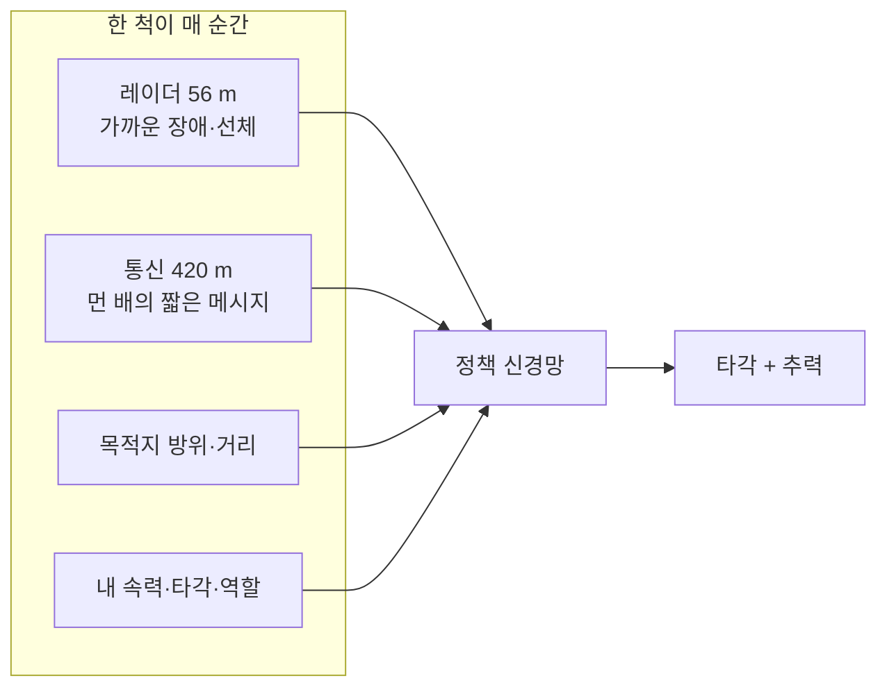

핵심 설계: **통신 사거리가 레이더보다 훨씬 길다.**  
가까이 오기 전에는 상대가 레이더에 안 잡힌다. 그 정보를 쓰려면 메시지가 있어야 한다. 통신이 쓸모있으려면 이 갭이 필요하다.

역할(COLREGS)은 신경망이 고르지 않는다. 두 배의 기하로 바로 판정한다.

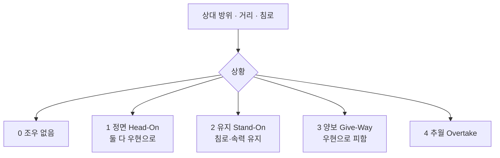

---

## 2. 신경망 — 세 덩어리

한 척 안에 그물이 **세 개**다. 생김새는 비슷하지만 **가중치는 따로**다.

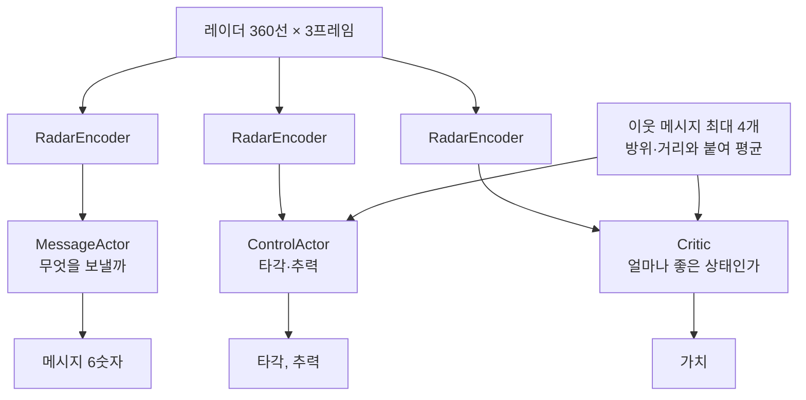

읽기 포인트

- **제어와 메시지는 레이더를 공유하지 않는다.** 같은 30차원으로 줄이지만, 서로 다른 인코더다. “보고 말하기”와 “보고 조타”가 같은 특징을 쓴다고 가정하면 안 된다.
- 레이더는 Conv로 읽은 뒤 **30숫자로 납작하게** 눌린다. 옛 30섹터 레이더의 자리만 남은 병목이다.
- 학습은 PPO. 모든 배가 **같은 정책**을 공유한다.

메시지 6숫자는 사람이 읽도록 설계한 AIS가 아니다. 수신 쪽이 쓸 수 있게 학습이 채운 잠재벡터다. 목표를 실어 나르도록 보조 손실(goal-comm, consumer)을 걸었다.

---

## 3. 네 가지 구조 (Fig2가 비교하는 것)

조우 상황이 다섯이니, “상황마다 전문가 신경망을 두자”가 출발점이다. 갈리는 것은 **레이더 인식부까지 나눌지**다. 인식부가 파라미터의 약 90%다.

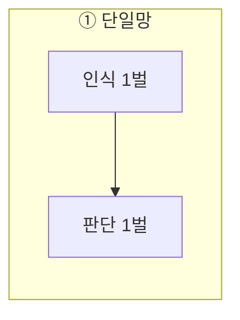

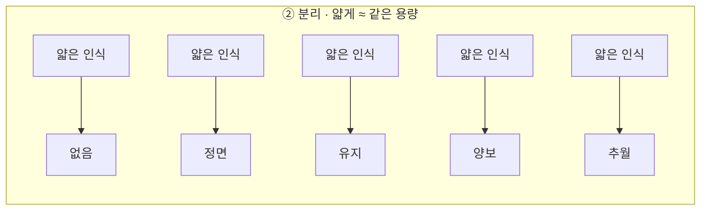

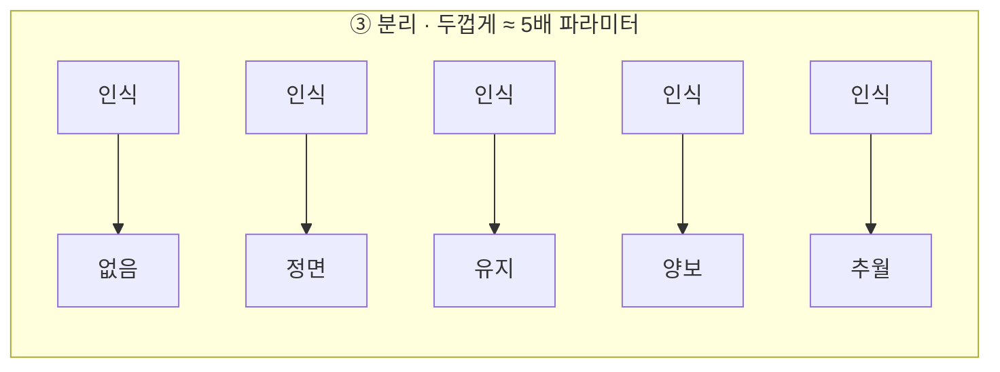

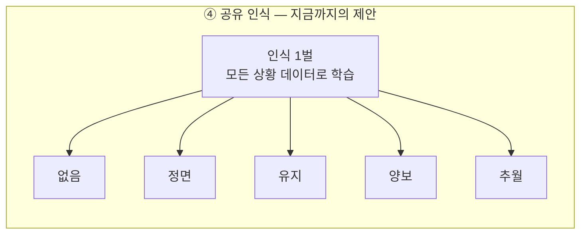

직관

| 구조 | 직관 | v11에서 일어난 일 |
|------|------|-------------------|
| 단일망 | 나누지 않는다 | **도착·근접 최고** |
| 분리 얇게 | 용량은 같은데 인식만 쪼갠다 | 단일망보다 못함 → 쪼갠 인식이 원인 |
| 분리 두껍게 | 전문가에게 풀 인식 | **최악**. 데이터까지 쪼개짐 |
| 공유 | 눈은 같이, 손만 역할별 | 분리형보다는 낫고, 단일망보다는 못함. 유지 역할만 조금 이김 |

**토론 1.** 제안 구조를 공유 MoE로 유지할 것인가, 단일망 + 통신으로 내릴 것인가.  
공유가 이기게 재학습하는 것은 가능하지만, 지금은 데이터가 그 문장을 지지하지 않는다.

---

## 4. 숫자를 이렇게 읽자

평가: 학습이 끝난 정책을 **고정**하고 수천 항해를 다시 돌린다. 학습 곡선과 다른 자다.

| 이름 | 쉬운 말 | 주의 |
|------|---------|------|
| **도착** | 끝난 항해 중 목적지에 닿은 비율 | hub 약 **94%** |
| **근접** | 박스끼리 겹쳐 끊긴 항해 / (끝난 것 + 아직 안 끝난 것) | hub 약 **2.4%**. “충돌 10%”가 아님 |
| **C (준수)** | 조우 한 쌍이 역할대로 움직였는지 | v2로 고치면 거의 **96%**. ON/OFF가 안 갈림 |
| 연료 · 조타 · 최소간격 | 도착한 배들의 효율 | 간격은 보통 **21 m** (선체 폭의 여러 배) |

왜 “충돌 6–10%”가 나왔나.

끝난 항해만 모으면 도착+겹침 ≈ 100%가 된다. 아직 가는 중인 배를 빼서 분모가 작아진 것이다. 미완을 넣으면 2%대가 되고, 예전 납품 그림과 같은 자리다. **학습이 갑자기 나빠진 게 아니다.**

준수 C를 예전 정의로 재면 ~55%인데, 거의 전부 “유지측이 목적지 쪽으로 25° 이상 틀었다”이다. 조우가 없을 때도 그 정도로 돈다. 규정 위반이 아니라 채점 문턱이다. 지금은 그 문턱을 고쳤고, 대신 C는 천장이다.

**토론 2.** 논문 본문에 근접(또는 안전거리 침범)이라고 쓸지, 충돌이라고 쓸지. 기하학적으로는 박스 교차다. 독자가 10% 사고율로 읽지 않게만 하면 된다.

---

## 5. 여덟 그림 — 질문, 결과, 회의에서 정할 것

공통: 16척, 메시지 6차원, 이웃 4, 규정 항 0.45, 통신 9M부터. **그림마다 이것 중 하나만 바꾼다.**

### Fig1 통신을 켜야 하나?

비교: 메시지 **있음 vs 항상 0**. 구조는 같다.

| | 도착 | 근접 |
|--|------|------|
| 끔 | 90.4 | 3.7 |
| 켬 | **93.7** | **2.4** |

통신은 도착을 올리고 겹침을 줄인다. 연료는 같고, 조타는 켠 쪽이 더 많다 (더 많이 변침). 준수 C는 둘 다 ~96%라 **통신의 증거로 쓰지 않는다.**

납품 그림의 “교차 준수 +12pp”는 옛 채점의 이야기이다.

### Fig2 눈을 몇 벌 둘까?

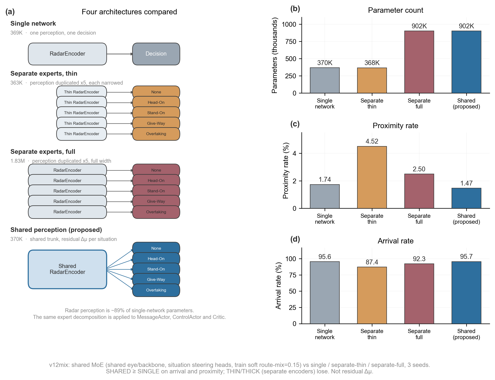

위 3절. 분리형은 실패. **잔차 공유 허브가 단일망을 도착·근접에서 이긴다** (95.3/1.7 vs 93.5/2.3). THIN/THICK는 v11 freeze.

### Fig3 몇 척의 말을 들을까?

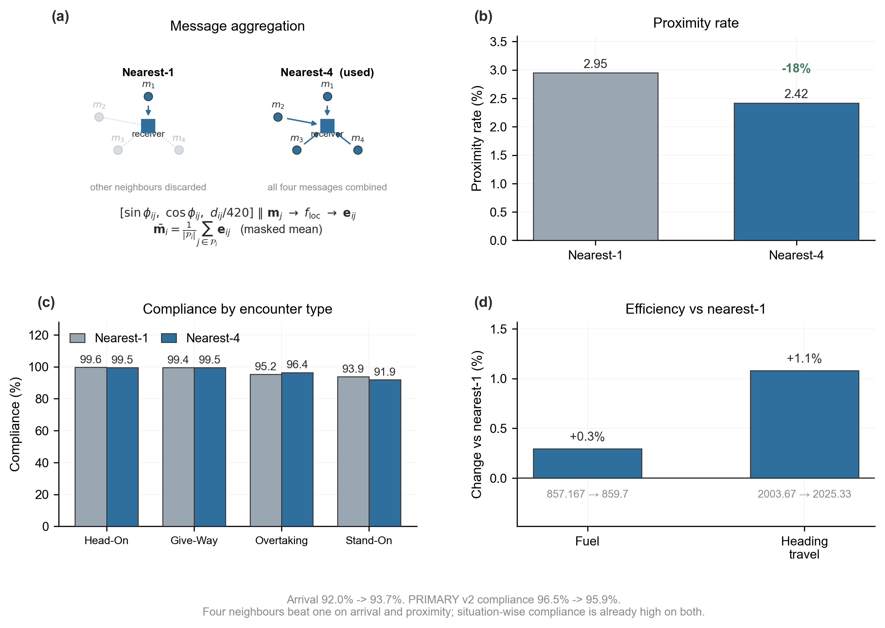

1척만 vs 가까운 4척. 4척(잔차 허브)이 도착 92.0→95.3, 근접 2.9→1.7. 1척 팔은 v11 freeze(잔차 미재학습).

### Fig4 메시지는 몇 차원?

2…12 중 **6을 허브로 유지**. DIM6–12는 잔차+L2, DIM2/4는 v11 freeze. 더 넓혀도 이득이 일관되지 않는다. 준수로 고르면 안 된다.

### Fig5 규칙을 보상에 넣을까?

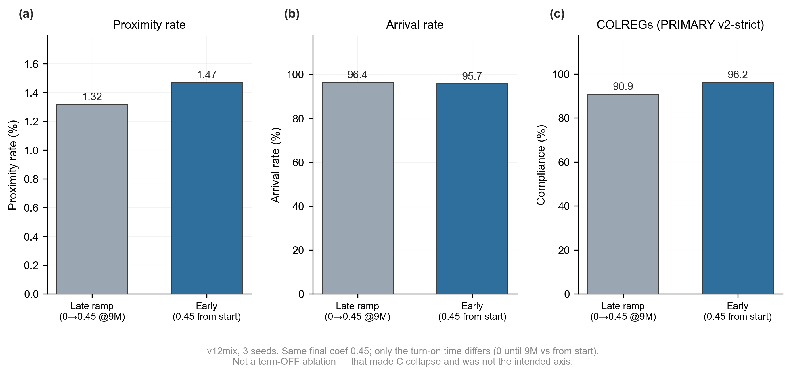

규정 벌점을 끄면 준수는 **67%로 무너진다** (특히 유지 59%).  
켜면 준수 94.6%. 잔차 허브에서는 도착·근접이 거의 같다 (95.3 / 1.7 vs 95.4 / 1.8).

한 줄: **규정 항은 역할 분담을 산다.** OFF 팔은 v11 freeze.

### Fig6 통신을 언제 켜나?

처음부터(잔차 comm@0, L2 없음) vs 중반 9M(잔차+L2 허브). 늦게 켜는 쪽이 도착·근접이 낫다 (92.1/3.0 → 95.3/1.7). 처음부터 켜도 붕괴하지는 않는다.

### Fig7 일부만 송신하면? (재학습 없음)

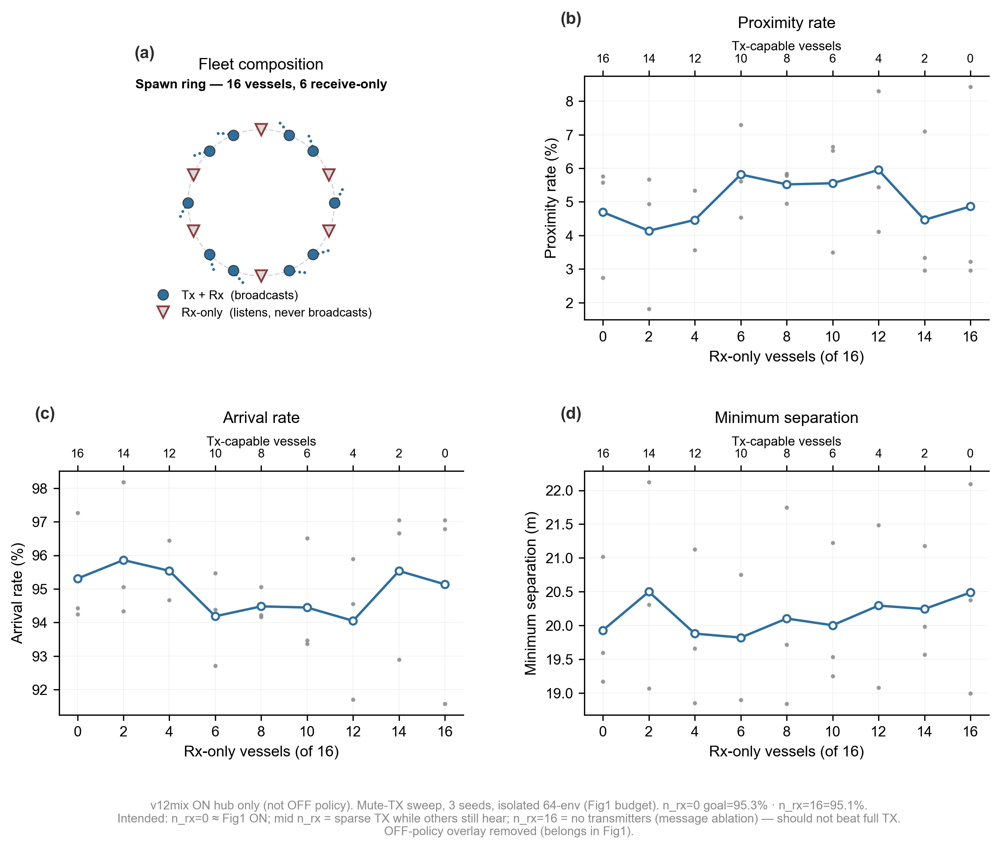

16척 중 몇 척이 **보내지는 못하고 듣기만** 한다. 곡선이 거의 평평하다.

Fig1의 “끔”은 메시지를 **아예 안 넣는 것**이다. 듣기만 하는 배는 아직 남의 방송을 듣는다. 송신 2척만 있어도 정보가 돈다. 그래서 Fig1과 모순이 아닐 수 있다. 다만 지금 채점이 Fig1과 다른 자라, 같은 자로 다시 재는 게 먼저다.

### Fig8 전역 A* 경로를 붙이면? (재학습 없음)

해안선에서 직진 vs A* 경유점. 정책을 경로용으로 다시 배우지 않았다.

전체 평균은 timeout ~35%라 도착 ~55%이고, A*가 이기지 않는다. 이미 뚫린 쌍까지 섞여 우회 비용만 보인다. **막힌 쌍만 나눠 봐야** “붙일 수 있다”는 문장이 성립한다.

---

## 6. 한눈에 인과

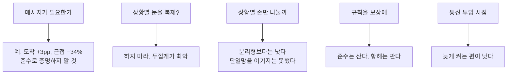

보상 한 줄 (왜 겹침이 0이 아닌가): 겹침은 금지이 아니라 **−450점**이다. 멀리 돌아가 늦게 도착하는 비용이 그보다 작으면, 학습은 가끔 겹치는 쪽을 고른다. 페널티를 키우면 배가 멈추거나 시간초과가 는다. 그래서 숫자를 더 깎자고 freeze를 흔들지 않기로 했다.

---

## 7. 오늘 정하면 좋은 것

1. **제안 구조**  
   A) 공유 MoE를 유지하고 “인식 복제는 실패, 단일망이 평균은 더 좋음”을 솔직히 쓴다.  
   B) 공유가 단일망을 이기게 재학습 파일럿을 한다 (인코더 공유·레이더 병목). 실패하면 A로 돌아간다.

2. **안전 지표 이름**  
   근접 / 안전거리 침범 / 박스 교차. 독자가 “사고율 10%”로 읽지 않게.

3. **준수 C**  
   Fig5(규정 항)에서만 크게 말하고, Fig1 통신 증거로는 쓰지 않는다.

4. **Fig7·8**  
   재학습 전에 채점을 Fig1과 맞추고, Fig8은 막힌 쌍만 따로 본다.

5. **다시 학습하지 않기로 한 것**  
   충돌 페널티 확대, 규정 항을 키워 근접까지 뒤집기, 처음부터 통신을 켜 붕괴를 연출하기, 그림마다 freeze를 따로 달기.

회의 전에 `figures/Fig1_….png` … `Fig8_….png`를 같이 띄우면 된다.
