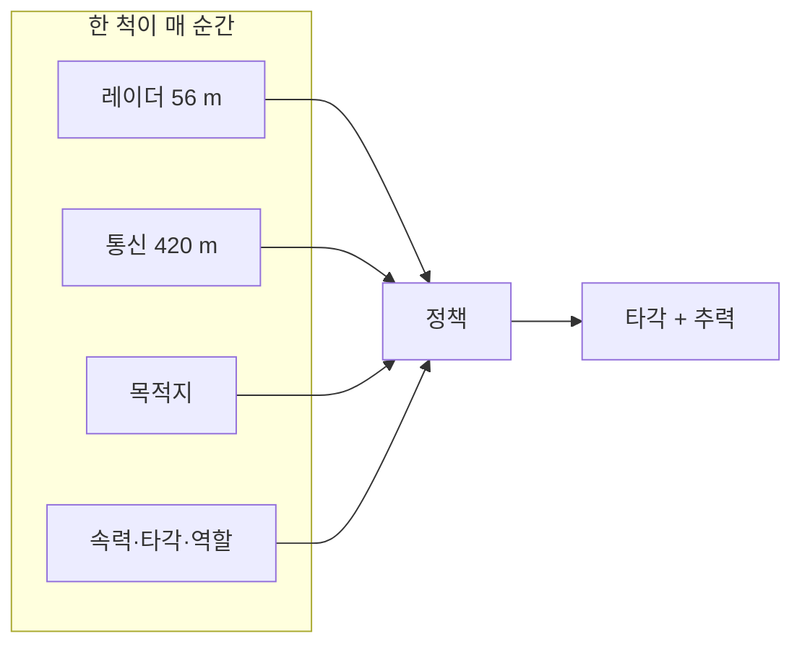
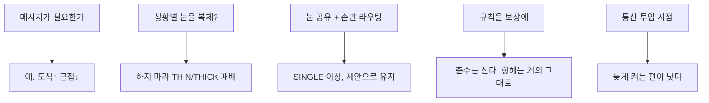

# 공저자 토론용 — 이 논문이 하는 일

2026-09-23, **v12mix** hub 실측 기준 (FINAL 아님).

숫자·문장 엄밀본: [CLAIMS.md](CLAIMS.md)  
코드·학습 설정: [IMPLEMENTATION.md](IMPLEMENTATION.md)  
그림 파일: [figures/](figures/)  
게이트: `runs/paper/v12mix/GATE.txt`, `runs/paper/v12mix_hub/GATE.txt`, `GATE_C2.txt`

이 문서는 **그림과 쉬운 말**로 토론하기 위한 것이다. 회의에서 이 파일만 띄워도 된다.

---

## 0. 30초 요약

혼잡한 해역에서 배들이 **레이더만으로는 안 보이는 먼 배**와 짧은 메시지를 주고받으며, COLREGS(항법 규칙) 역할에 맞춰 피하고 목적지에 간다.

묻는 것:

1. 그 메시지가 실제로 도움이 되나? → **예** (Fig1)
2. 상황별 조타를 어디서 나누나? → **눈은 공유, 손만 상황 라우팅** (Fig2). 잔차 Δμ 아님.
3. 규정 점수를 보상으로 넣으면? → **준수만 산다** (Fig5)

제안 허브(v12mix): 공유 MoE + 학습 soft route-mix=0.15(평가는 hard) + Message/Critic 단일 + 타이 인코더.  
Fig1–7은 **같은 레시피** 위에서 축 하나만 바꾼다.

---

## 1. 배가 사는 세계

16척 · 600×600 m · 레이더 56 m ≪ 통신 420 m · ring 0.7.

역할(COLREGS)은 기하로 판정한다. 신경망이 고르지 않는다.

---

## 2. 제안 구조 (한 눈)

- **눈(레이더 인코더·백본)은 공유**한다.
- **조타 헤드만** 상황(없음/정면/유지/양보/추월)으로 라우팅한다.
- 학습 때 soft mix=0.15로 희소 헤드에 그라디언트를 흘린다. 평가는 hard.
- Message / Critic는 단일망. **잔차 Δμ가 아니다.**

---

## 3. 숫자를 이렇게 읽자

| 이름 | 쉬운 말 | hub |
|------|---------|-----|
| **도착** | 끝난 항해 중 목적지 도달 | **95.7±0.9%** |
| **근접** | 박스 겹침 / (종료+창끝 미완) | **1.47±0.56%** |
| **C_v2** | PRIMARY v2 준수 | **~98%** (천장) |

조건 선택은 **도착·근접**. C는 Fig5에서만 크게 말한다.

---

## 4. 일곱 그림

### Fig1 통신을 켜야 하나?

| | 도착 | 근접 | C_v2 |
|--|------|------|------|
| OFF | 92.7 | 2.55 | 98.1 |
| ON | **95.7** | **1.47** | 98.3 |

통신: 도착 +3.1pp, 근접 −1.1pp (시드 2/3). **C로 통신 이득을 말하지 않는다.**

### Fig2 전문화를 어디서 하나?

| | 도착 | 근접 |
|--|------|------|
| **SHARED** | **95.7** | **1.47** |
| SINGLE | 95.6 | 1.74 |
| THICK | 92.3 | 2.50 |
| THIN | 87.4 | 4.52 |

SHARED ≥ SINGLE (goal+prox, 시드 2/3). SHARED ≫ THIN/THICK (인식 분리 실패 = C2).

### Fig3 이웃을 몇 척 듣나?

K=4가 K=1보다 낫다 (95.7/1.47 vs 94.6/1.93).

### Fig4 메시지는 몇 차원?

DIM6이 최고. 8/10/12로 넓혀도 이득 없음(오히려 악화).

### Fig5 규칙을 보상에 넣을까?

규정 항 OFF→ON: C 65.8 → **98.3**. 도착·근접은 거의 같다.  
**규정 항은 역할 분담을 산다. “안전도 크게 개선” 과장 금지.**

### Fig6 통신을 언제 켜나?

@9M이 @0보다 낫다 (95.7/1.47 vs 93.1/2.48). 처음부터 켜도 시드 붕괴는 없다.

### Fig7 일부만 송신하면? (재학습 없음)

hub 고정, n_rx=0…16이 송신만 못 함. 함대 급락 없음. Fig1 OFF(메시지 전부 0)와 모순 아님.

---

## 5. 한눈에

---

## 6. 버리지 말 것

- 잔차 Δμ를 MoE라고 쓰지 않는다.
- YHSH 57%/1.83% 서사 금지.
- FINAL ckpt를 덮어쓰지 않는다.
- Fig1을 C로 증명하지 않는다.
- 환경 리깅으로 Fig1/Fig2를 맞추지 않는다 (학습 재균형만 허용했고, Fig2는 soft mix로 이김).

회의 전에 `figures/Fig1_….png` … `Fig7_….png`와 [CLAIMS.md](CLAIMS.md)를 같이 띄우면 된다.
