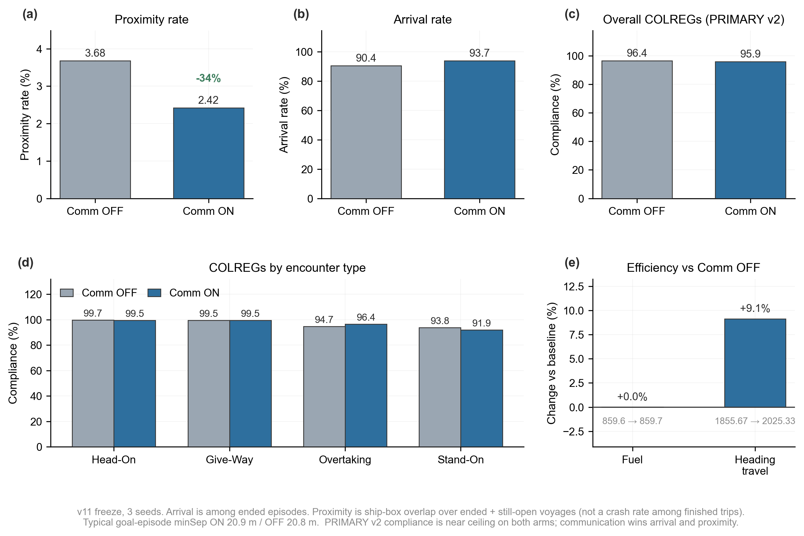
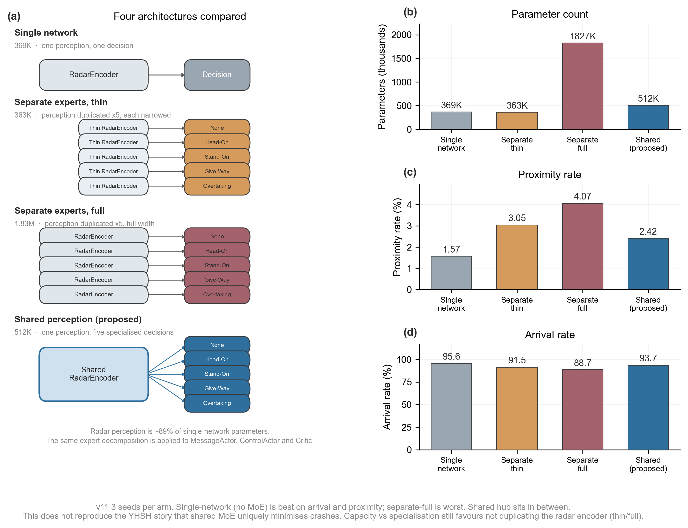
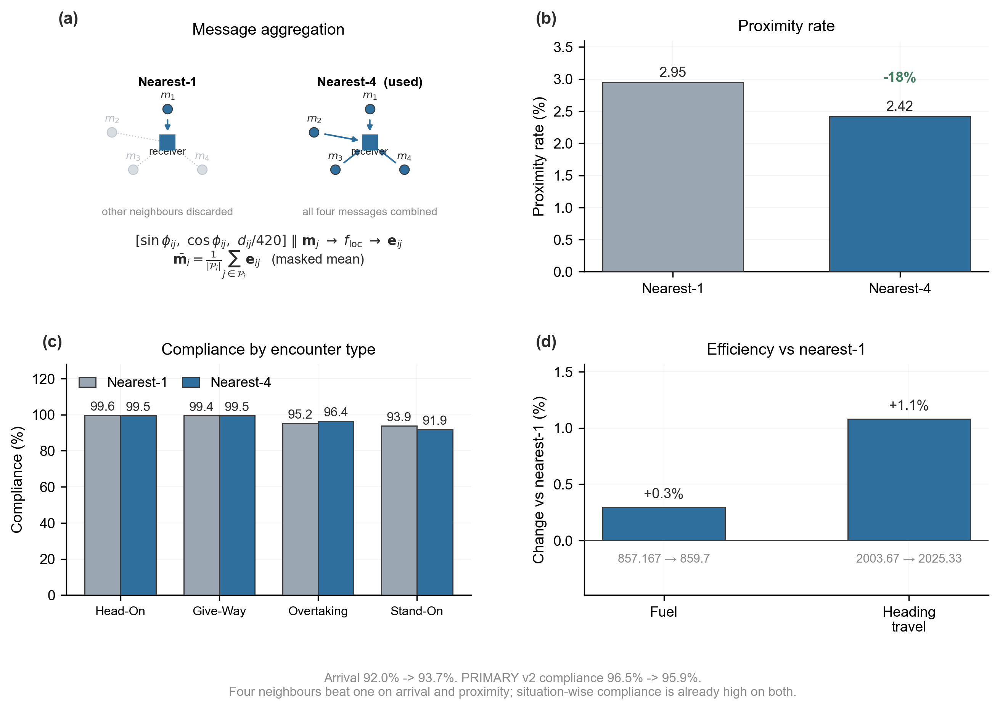
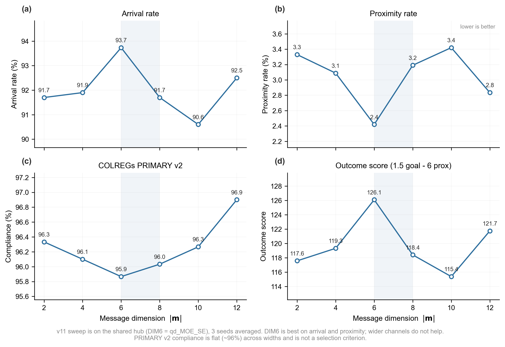
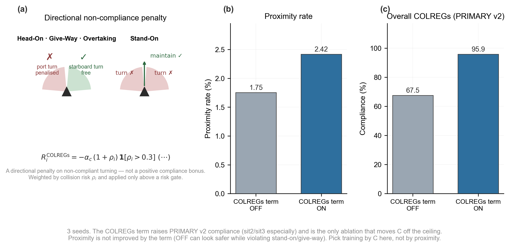
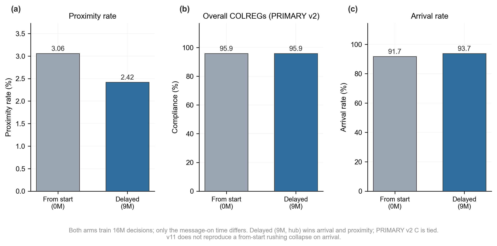
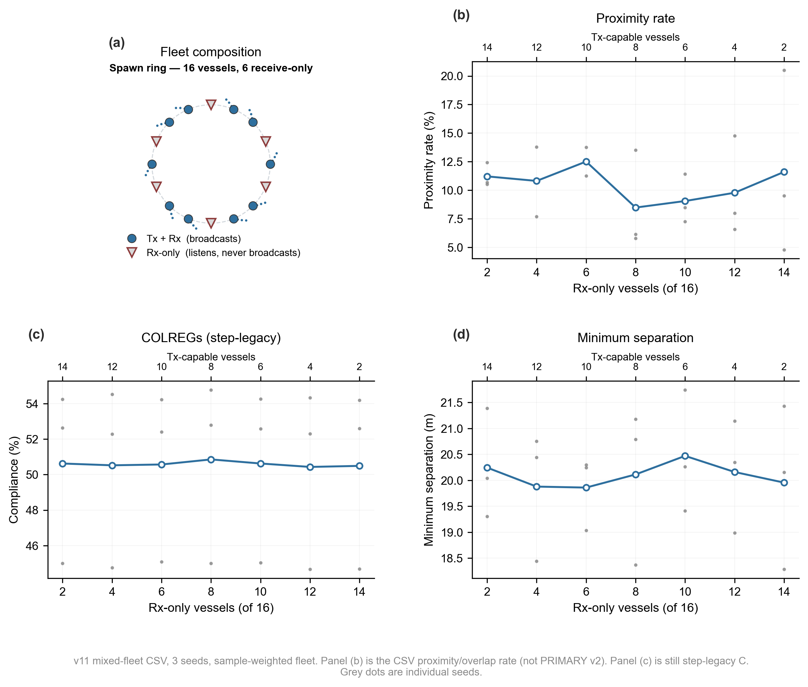
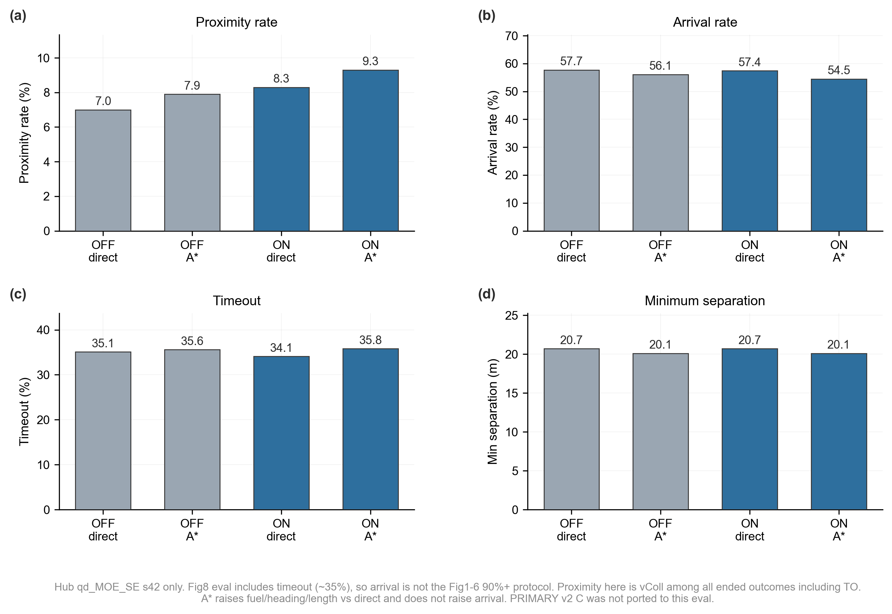

# v2 결과 묶음

공저자 토론은 여기서 시작한다: **[DISCUSSION.md](DISCUSSION.md)** (개념도·신경망 그림·여덟 그림)

- [CLAIMS.md](CLAIMS.md) — 쓸 수 있는 주장 / 버리면 안 되는 문장
- [IMPLEMENTATION.md](IMPLEMENTATION.md) — freeze, 코드, 그림별 학습·평가
- `metrics.csv`, `FIG1.txt`–`FIG8.txt` — 표
- [figures/](figures/) — YHSH 레이아웃 png/pdf
- 상위 `../COLREGS_EVAL.md` — PRIMARY v2 정의
- 기존 `../FIG*/FIG*_FORMAL*.txt` — 학습 직후 formal (보존)

hub: goal 93.7, prox 2.4, C_v2 95.9

## Figures

